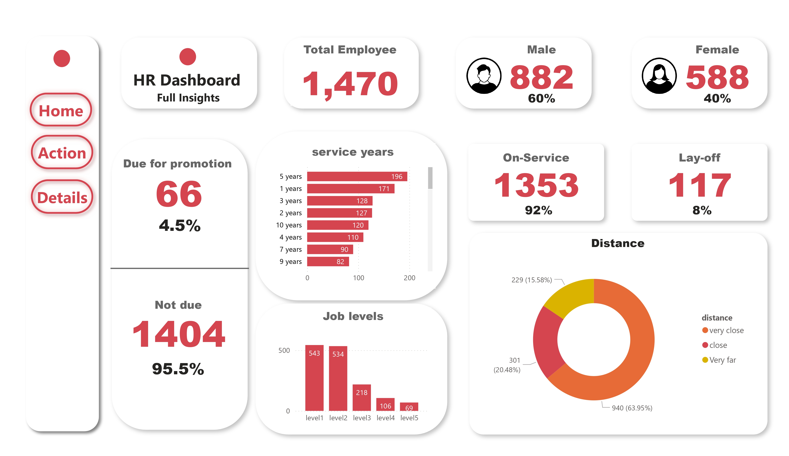
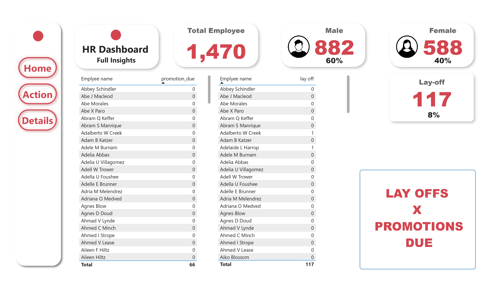
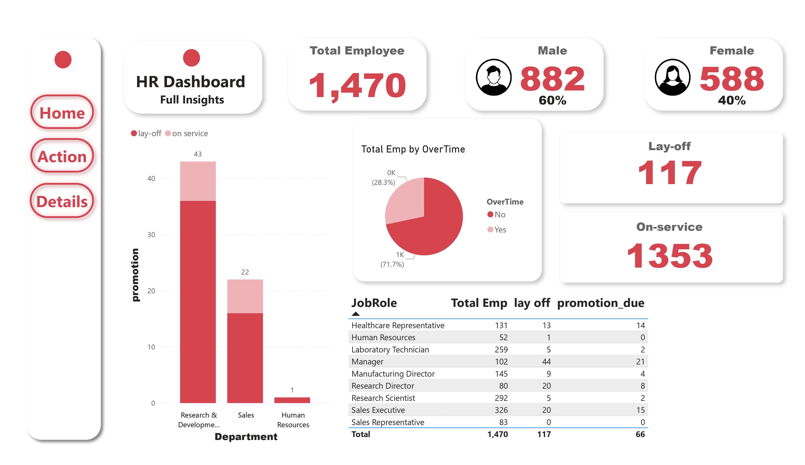

# 🧑‍💼 HR Analytics Dashboard

This project is an interactive dashboard built using cleaned HR data. It provides valuable insights into employee trends, attrition, satisfaction, and other key HR metrics.

## 📌 Project Summary

- 📊 **Data Cleaning**: Raw HR data was processed to remove null values, outliers, and inconsistencies.
- 📈 **Data Analysis**: Performed exploratory data analysis to uncover patterns.
- 🖥️ **Dashboard**: Created an interactive dashboard using  Power BI to visualize HR metrics in a user-friendly format.

## ⚙️ Features

- Interactive filters and dropdowns
- Visuals for attrition, department-wise distribution, satisfaction levels,promotions,layoffs,gender and more
- Real-time insights from HR datasets
- Responsive layout and intuitive design

## 🧰 Tech Stack

- Language: Python (Pandas, Matplotlib, Seaborn)
- Dashboard: Power BI 
- Data Source: HR dataset (CSV / Excel)
  
## 🖼️ Dashboard Screenshots

### 🏠 Home Page

### ⚙️ Action Page

### 📄 Details Page

